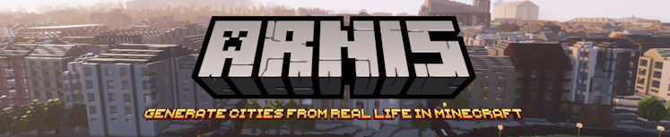
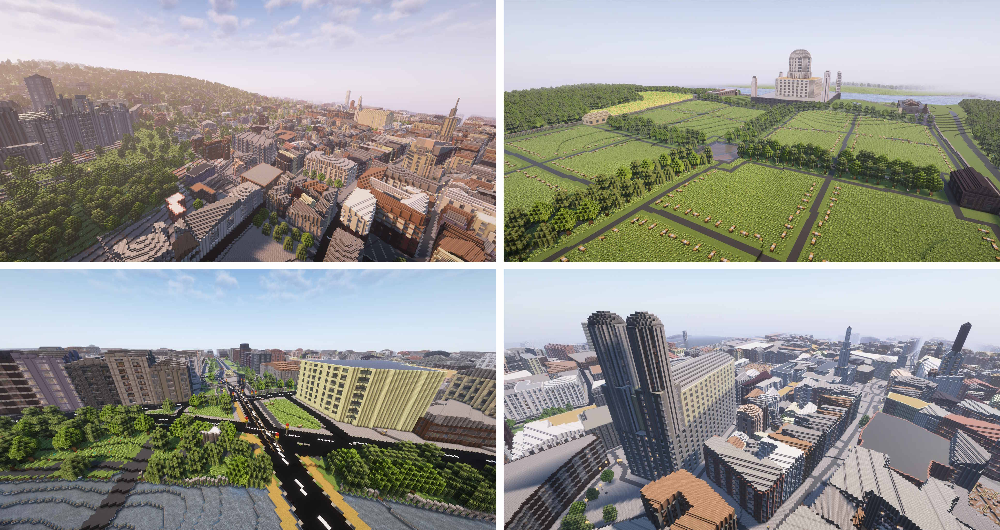
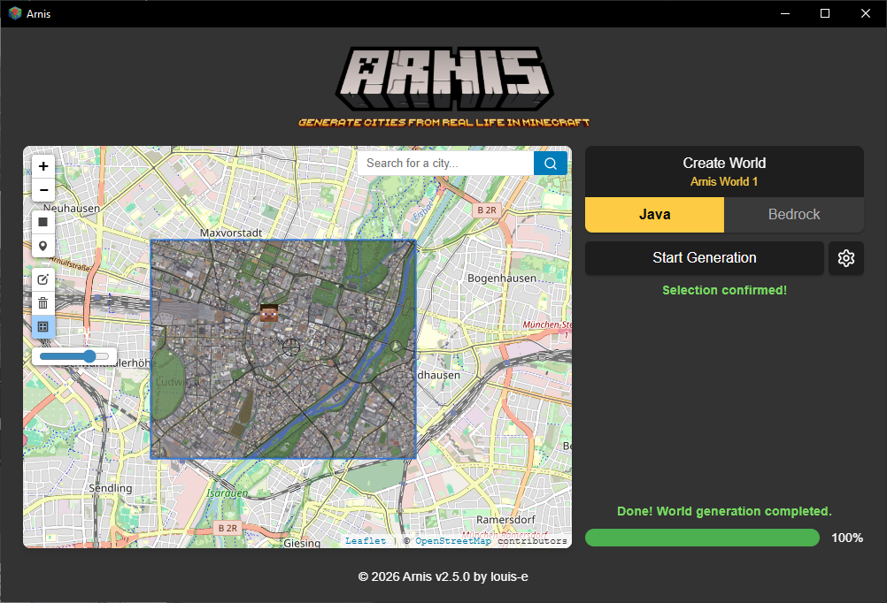

# mcosm [](https://github.com/koharachan/mcosm/actions) [](https://github.com/koharachan/mcosm/releases) [](https://github.com/koharachan/mcosm/releases) [](https://github.com/koharachan/mcosm/releases) [](https://discord.gg/mA2g69Fhxq)

mcosm creates complex and accurate Minecraft Java Edition (1.17+) and Bedrock Edition worlds that reflect real-world geography, topography, and architecture.

This free and open source project is designed to handle large-scale geographic data from the real world and generate detailed Minecraft worlds. The algorithm processes geospatial data from OpenStreetMap as well as elevation data to create an accurate Minecraft representation of terrain and architecture.
Generate your hometown, big cities, and natural landscapes with ease!

_**Want mobile generation or larger map sizes?** [MapSmith](https://arnismc.com/mapsmith/) generates worlds in your browser, no install required._


<i>This GitHub page is the official project website. Do not download mcosm from any other website.</i>

## :keyboard: Usage
<br>
Download the [latest release](https://github.com/koharachan/mcosm/releases/) or [compile](#trophy-open-source) the project on your own.

Choose your area on the map using the rectangle tool and select your Minecraft world - then simply click on <i>Start Generation</i>!
Additionally, you can customize various generation settings, such as world scale, spawn point, or building interior generation.

## 📚 Documentation


Full documentation is available in the [GitHub Wiki](https://github.com/koharachan/mcosm/wiki/), covering topics such as technical explanations, FAQs, contribution guidelines and roadmaps.

[backgroundvid.webm](https://github.com/user-attachments/assets/420acc19-a850-418e-8397-1a45b05582ab)

## :trophy: Open Source
#### Key objectives of this project
- **Modularity**: Ensure that all components (e.g., data fetching, processing, and world generation) are cleanly separated into distinct modules for better maintainability and scalability.
- **Performance Optimization**: We aim to maintain strong performance and fast world generation.
- **Comprehensive Documentation**: Detailed in-code documentation for a clear structure and logic.
- **User-Friendly Experience**: Focus on making the project easy to use for end users.
- **Cross-Platform Support**: We want this project to run smoothly on Windows, macOS, and Linux.

#### How to contribute
This project is open source and welcomes contributions from everyone! Whether you're interested in fixing bugs, improving performance, adding new features, or enhancing documentation, your input is valuable. Simply fork the repository, make your changes, and submit a pull request. Please respect the above-mentioned key objectives. Contributions of all levels are appreciated, and your efforts help improve this tool for everyone.

Command line Build: ```cargo run --no-default-features -- --terrain --path="C:/YOUR_PATH/.minecraft/saves/worldname" --bbox="min_lat,min_lng,max_lat,max_lng"```<br>
GUI Build: ```cargo run```<br>

After your pull request is merged, I will take care of regularly creating update releases which will include your changes.

If you are using Nix, you can run the program directly with `nix run github:koharachan/mcosm -- --terrain --path=YOUR_PATH/.minecraft/saves/worldname --bbox="min_lat,min_lng,max_lat,max_lng"`

## :star: Star History

<a href="https://star-history.com/#koharachan/mcosm&Date">
 <picture>
   <source media="(prefers-color-scheme: dark)" srcset="https://api.star-history.com/svg?repos=koharachan/mcosm&Date&theme=dark" />
   <source media="(prefers-color-scheme: light)" srcset="https://api.star-history.com/svg?repos=koharachan/mcosm&Date&type=Date" />
   
 </picture>
</a>

## :newspaper: Academic & Press Recognition


mcosm is based on Arnis, which has been recognized in various academic and press publications after gaining more attention in December 2024.

[Building realistic Minecraft worlds with Open Data on AWS: How Arnis uses elevation datasets at scale](https://aws.amazon.com/de/blogs/publicsector/building-realistic-minecraft-worlds-with-open-data-on-aws-how-arnis-uses-elevation-datasets-at-scale/)

[Floodcraft: Game-based Interactive Learning Environment using Minecraft for Flood Mitigation and Preparedness for K-12 Education](https://www.researchgate.net/publication/384644535_Floodcraft_Game-based_Interactive_Learning_Environment_using_Minecraft_for_Flood_Mitigation_and_Preparedness_for_K-12_Education)

[Hackaday: Bringing OpenStreetMap Data into Minecraft](https://hackaday.com/2024/12/30/bringing-openstreetmap-data-into-minecraft/)

[TomsHardware: Minecraft Tool Lets You Create Scale Replicas of Real-World Locations](https://www.tomshardware.com/video-games/pc-gaming/minecraft-tool-lets-you-create-scale-replicas-of-real-world-locations-arnis-uses-geospatial-data-from-openstreetmap-to-generate-minecraft-maps)

[XDA Developers: Hometown Minecraft Map: Arnis](https://www.xda-developers.com/hometown-minecraft-map-arnis/)

Free to use press assets, including screenshots and logos, can be found [here](https://drive.google.com/file/d/1T1IsZSyT8oa6qAO_40hVF5KR8eEVCJjo/view?usp=sharing).

## :copyright: License Information
Copyright (c) 2022-2026 Louis Erbkamm (louis-e)
Copyright (c) 2026 koharachan

Licensed under the Apache License, Version 2.0 (the "License");
you may not use this file except in compliance with the License.
You may obtain a copy of the License at

http://www.apache.org/licenses/LICENSE-2.0

Unless required by applicable law or agreed to in writing, software
distributed under the License is distributed on an "AS IS" BASIS,
WITHOUT WARRANTIES OR CONDITIONS OF ANY KIND, either express or implied.
See the License for the specific language governing permissions and
limitations under the License.[^3]

Download mcosm only from the official source https://github.com/koharachan/mcosm/. Every other website providing a download and claiming to be affiliated with the project is unofficial and may be malicious.

The logo was made by @nxfx21.

NOT AN OFFICIAL MINECRAFT PRODUCT. NOT APPROVED BY OR ASSOCIATED WITH MOJANG OR MICROSOFT.

## :sparkles: Project Information

### About this project
mcosm is a fork of the [Arnis](https://github.com/louis-e/arnis) project, modified and enhanced with additional features.

### Added Features
- **Resume functionality**: Ability to resume interrupted generation tasks by using existing world directories
- **Improved CLI support**: Enhanced command-line interface for better automation and scripting
- **Tile-based generation**: Support for chunked generation of large areas

### CLI Usage

#### Basic Usage
```bash
# Generate a world from a file (GeoPackage)
mcosm.exe --file "path/to/data.gpkg" --bbox "min_lat,min_lng,max_lat,max_lng" --output-dir "path/to/output" --tiles-x 2 --tiles-z 2

# Generate a world from OpenStreetMapnmcosm.exe --terrain --path "path/to/output" --bbox "min_lat,min_lng,max_lat,max_lng"
```

#### Key Parameters
- `--file`: Path to a GeoPackage file containing geospatial data
- `--bbox`: Bounding box in format "min_lat,min_lng,max_lat,max_lng"
- `--output-dir`: Directory where the Minecraft world will be created
- `--tiles-x`, `--tiles-z`: Number of tiles to split the generation into (for large areas)
- `--terrain`: Enable terrain generation
- `--scale`: Scale factor for the world (default: 1.0)
- `--disable-height-limit`: Disable height limit for taller buildings

#### Resume Generation
To resume an interrupted generation, simply run the same command with the same `--output-dir` parameter. The program will detect the existing world and continue from where it left off.

```bash
# Resume generation
mcosm.exe --file "path/to/data.gpkg" --bbox "min_lat,min_lng,max_lat,max_lng" --output-dir "path/to/existing/world" --tiles-x 2 --tiles-z 2
```

### Example
```bash
# Generate Hong Kong from GeoPackage
mcosm.exe --file "temp/hong-kong.gpkg" --bbox "22.28,114.15,22.3,114.18" --output-dir "output_hk" --tiles-x 2 --tiles-z 2
```


[^1]: https://en.wikipedia.org/wiki/OpenStreetMap

[^2]: https://en.wikipedia.org/wiki/Arnis,_Germany

[^3]: https://github.com/koharachan/mcosm/blob/main/LICENSE
